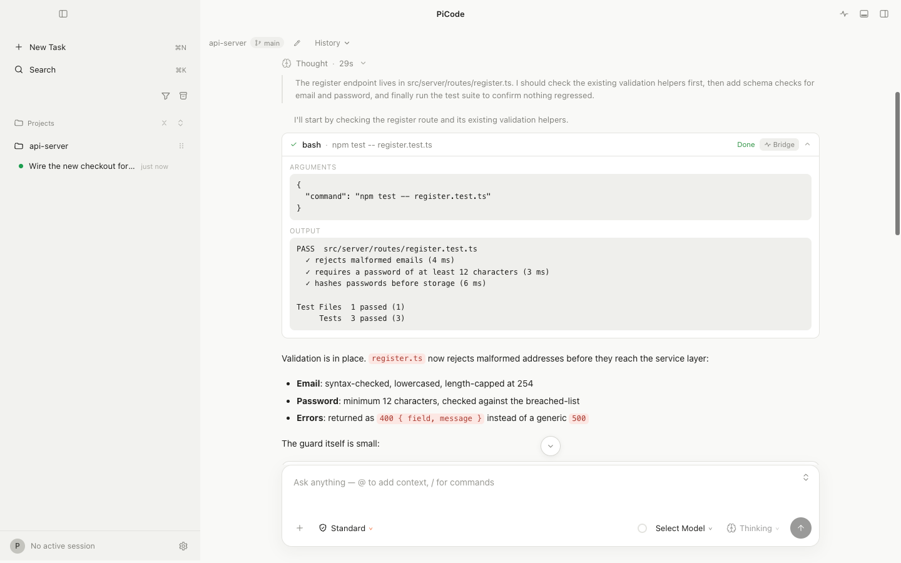
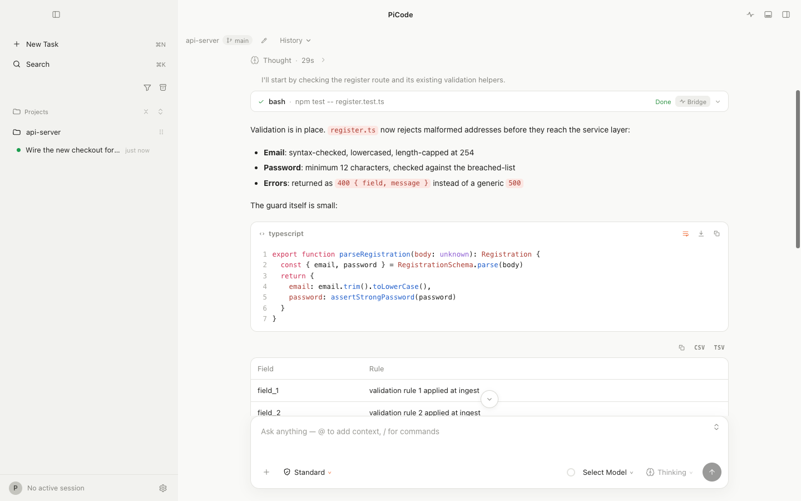
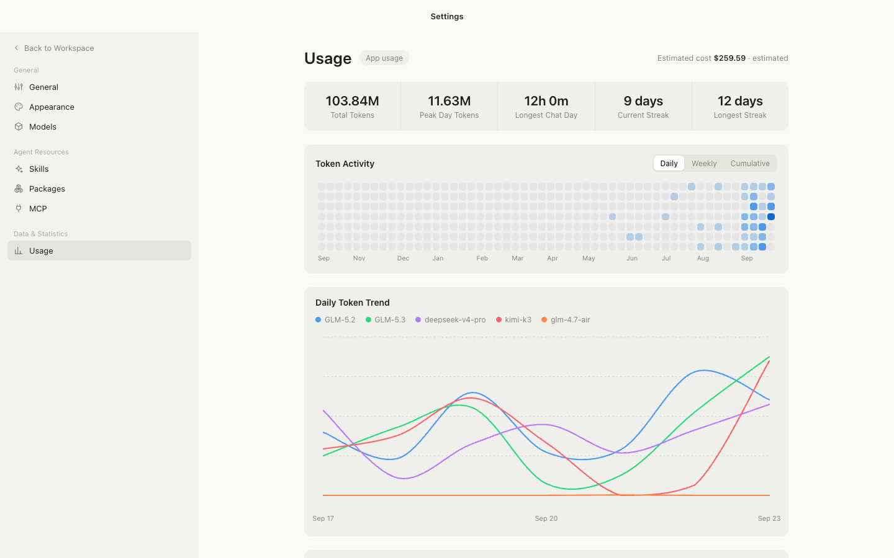
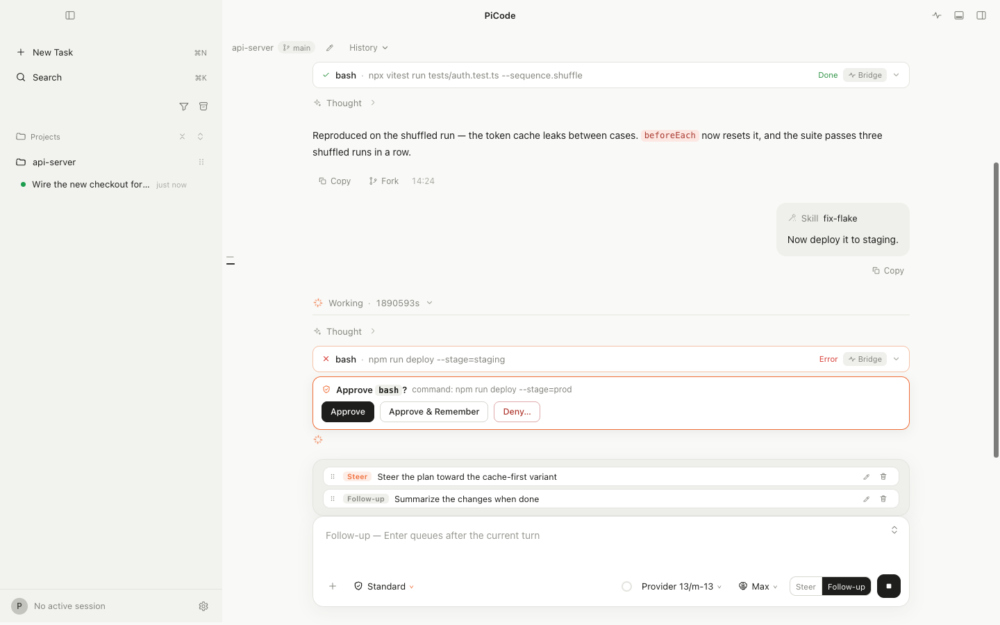
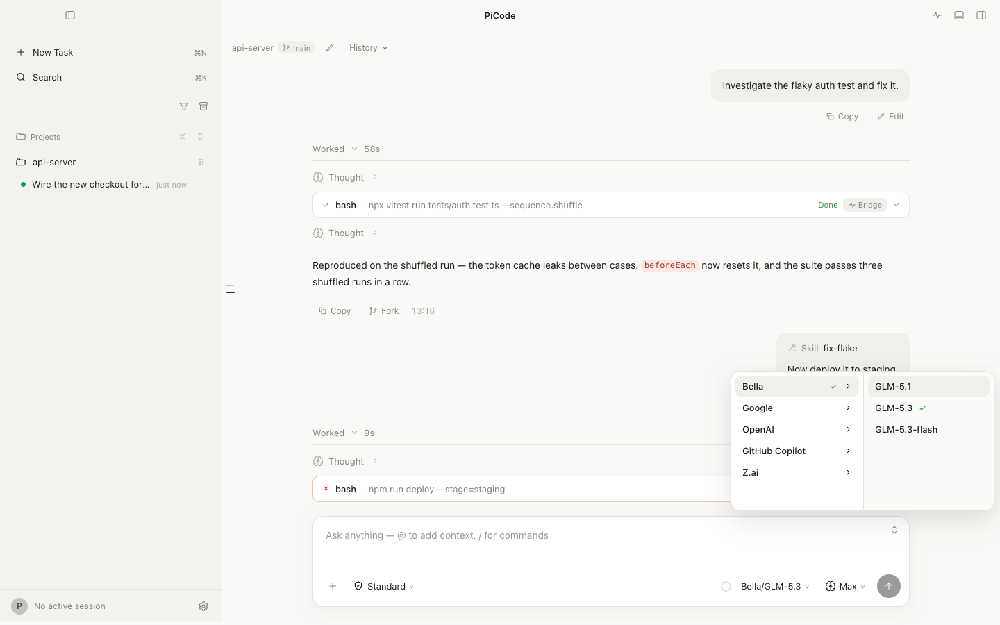
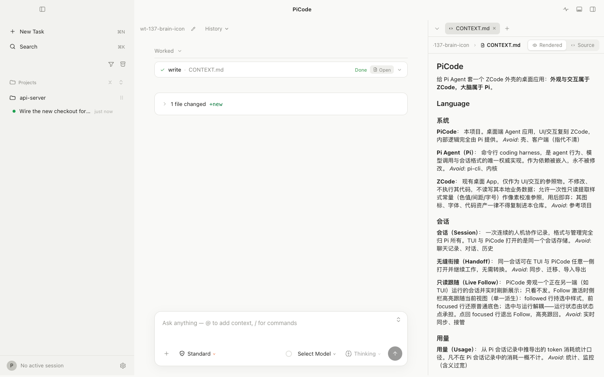
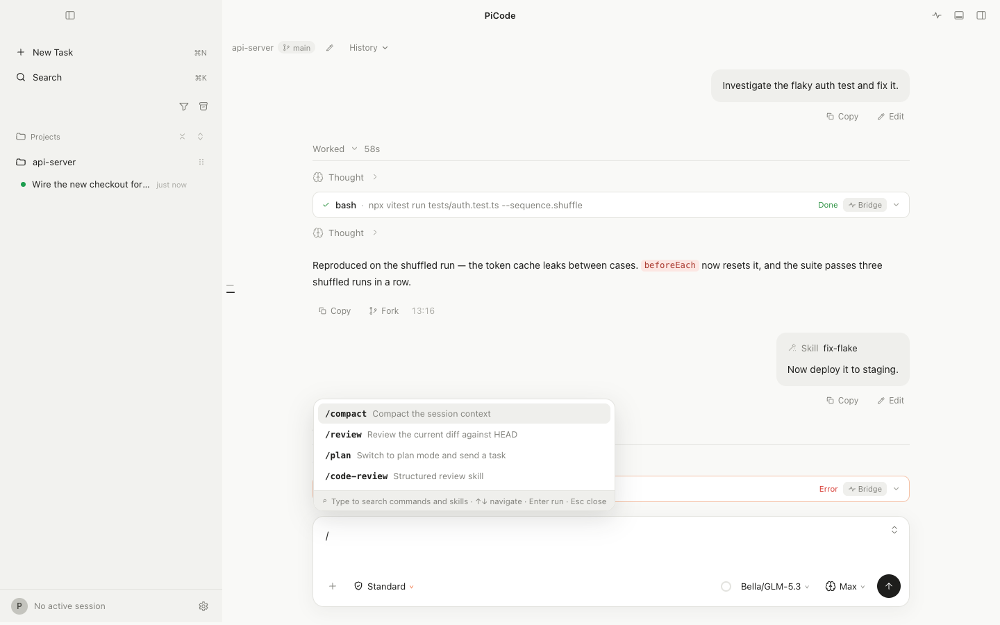
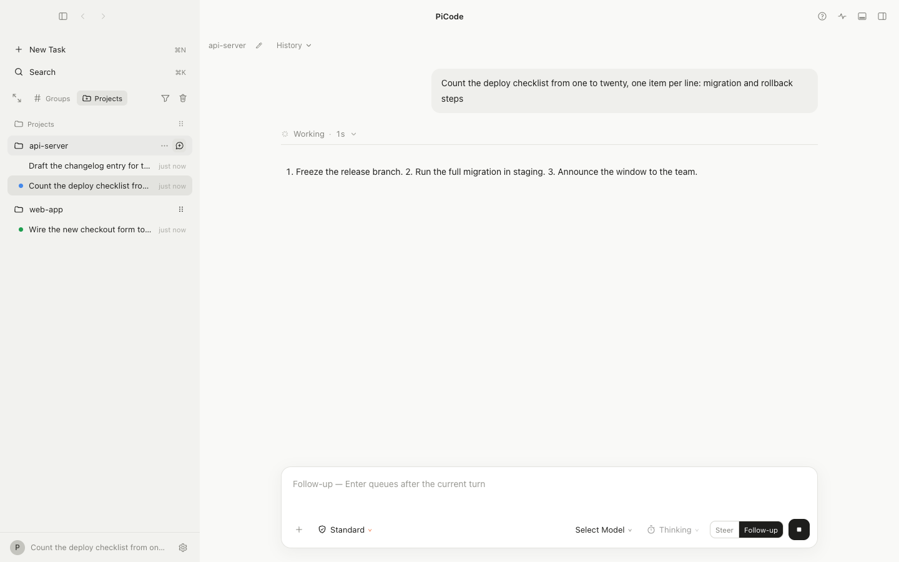

<div align="center">
  

# PiCode

**A product-grade macOS desktop app around the [Pi coding agent](https://github.com/earendil-works/pi).**

The shell's look and interaction model follow ZCode — the brain is Pi.

[](./LICENSE)
[](https://github.com/Liaokc/PiCode/tags)
[](https://github.com/Liaokc/PiCode)
[](https://nodejs.org)

**English** | [简体中文](./README.zh-CN.md)

</div>

---

Sessions, history, and usage stats are **shared with the Pi TUI**: a session created on either side shows up and resumes on the other (**Handoff**), and a session running in the TUI can be watched live from PiCode (**Live Follow**). No other desktop shell gives you that.

The red line: **no code or data inside the Pi installation or the ZCode app is ever modified** — everything lives in this repository.

<p align="center">
  
</p>

## ✨ Features

- 🔁 **Handoff** — the same session library as the Pi TUI: start a session on either side, resume it on the other
- 👁️ **Live Follow** — watch a session running in the TUI stream live from PiCode, in real time
- 🖥️ **Three-zone shell** — Tasks sidebar (grouped by project) · chat main area · resizable side panel hosting **Terminal** (real PTY), **Review** (workspace diff) and **File Preview** tabs
- 📊 **Usage analytics** — token totals, streaks, a 52-week activity heatmap, per-model trends and estimated cost, aggregated from all Pi session records — TUI included
- 🧠 **Full agent surface** — approval gates (approve / remember / deny), Steer & Follow-up queues, thinking levels, the subagent fleet, and skills · packages · MCP management in the settings window
- 🛡️ **Read-only red line** — never modifies code or data inside the Pi installation or the ZCode app

## 📸 Screenshots

| | |
|:---:|:---:|
|  |  |
| Syntax-highlighted code cards with line numbers, wrap toggle and download. | The Usage page — token totals, streaks, a 52-week activity heatmap and per-model trends. |
|  |  |
| The approval gate plus the Steer / Follow-up queue, inline. | A two-column model picker across all configured providers. |
|  |  |
| File preview with a Rendered/Source toggle for markdown. | Slash commands with fuzzy search. |

<p align="center">
  <br />
  <sub>The projects sidebar with session status dots and hover actions.</sub>
</p>

## 🚀 Quick Start

**Requirements:** macOS · Node.js 24+ · working Pi auth in `~/.pi/agent` (the same credentials the `pi` TUI uses)

```bash
npm install     # prefix ELECTRON_MIRROR=https://npmmirror.com/mirrors/electron/ if the Electron download stalls
npm run dev     # dev app
```

To produce a local app bundle:

```bash
npm run package            # → release/PiCode-darwin-<arch>/PiCode.app (unsigned local artifact, asar off so the host child can fork)
npm run package:verify     # …then boot the artifact with PICODE_SMOKE=1 and require a real-session smoke round to exit 0
```

## 🏗 Architecture

Three-zone shell: navigation sidebar (Tasks grouped by project), chat main area, and a resizable side panel hosting Terminal (full PTY), Review (workspace diff), and File Preview tabs. A settings window covers defaults, appearance, read-only provider auth status, and the Usage page.

| Zone | Role |
|------|------|
| `src/renderer` | React UI. Never imports the Pi SDK — it consumes pure reducers over the IPC contract. |
| `src/main` | Electron main process: host supervisor, session index (shared store scan + Live Follow tail), usage aggregation cache, review/preview readers, terminal service (the only node-pty consumer). |
| `src/preload` | Typed bridge exposing exactly the IPC surface above. |
| `src/host` | Isolated agent host child process; the **only** place `@earendil-works/pi-coding-agent` (pinned version, ADR-0005) is loaded. One host instance backs one Session. |
| `src/shared` | The contract (`ParentToHost`/`HostToParent`), pure reducers, parsers, and aggregators — the testable core. |

Architecture decisions live in [`docs/adr/`](./docs/adr) (0001–0005, all current); the domain vocabulary in [`CONTEXT.md`](./CONTEXT.md); the product spec in `.scratch/picode-1-0/spec.md`.

## 🧪 Development

```bash
npm run typecheck          # tsc over node + web tsconfigs
npm run lint
npm test                   # vitest unit suite (the three spec test seams)
```

## 🔬 Compatibility smoke suite

One command runs every compatibility red line against the real Pi SDK and the real shared session store:

```bash
npm run smoke
```

Stages (fail fast, per-stage timings):

1. **build** — electron-vite bundles
2. **host contract** — real SDK streaming, approval gate (approve/remember/deny), access-mode tiers, queue semantics, model/thinking switches, resume/rename/tree/fork
3. **pty** — real pseudo-terminal under Electron's node ABI
4. **usage aggregation** — read-only scan of the real TUI store + incremental fold machinery on a temp store
5. **TUI↔SDK interop** — both directions: a TUI-written session parses through the session index, transcript, and the SDK's own `SessionManager`; a host-written session re-opens via the SDK, shows in the index, folds into usage, and resumes in a second host process
6. **electron app smoke** — the real shell: main→host→renderer DOM, sidebar index, Live Follow, session-scoped crash isolation, multi-active sessions (several hosts alive across focus switches, background streaming, same-pid refocus with a caught-up transcript, no-orphan shutdown)

Stages 2, 5, and 6 make real model calls (a few minutes total).

### Session hygiene (ticket 13)

Smoke runs never write the real session library. The suite exports
`PICODE_SESSION_DIR` (a throwaway store the host and the app's session index
honor) and verifies **zero session-file growth** in `~/.pi/agent/sessions`
across the whole run — the suite fails if a stage leaks a session file.
Standalone smoke entry points (`npm run smoke:host` / `smoke:interop` /
`smoke:electron`) self-isolate the same way. `PICODE_SESSION_DIR` is also
honored by `npm run package:verify`. Auth, models and settings always come
from the real `~/.pi/agent` — only session writes are redirected.
`npm run smoke:layout` (ticket 29) boots the built app on throwaway
**userData** and drives real pointer drags: sidebar width clamp + reset,
both pane widths persisted across a restart.

Model usage aggregation folds model ids case-insensitively (a gateway echoing
`glm-5.3-flash` for the configured `GLM-5.3-flash` counts as ONE model; the
display keeps the first-seen spelling). The one-time cleanup for historical
smoke-polluted stores (dry run by default):

```bash
node scripts/cleanup-smoke-sessions.ts        # list what would be deleted
node scripts/cleanup-smoke-sessions.ts --yes  # delete
```

## 🎞 Visual QA

Screenshot harnesses capture the real UI for pixel comparison against the ZCode baselines in `.scratch/reference/screenshots/` (record: `.scratch/picode-1-0/visual-redline-final.md`):

```bash
npm run visual:transcript   # transcript, menus, pill/queue, preview, review
npm run visual:settings     # ⌘K palette + settings sections
npm run visual:usage        # usage page (deterministic fixture)
npm run visual:multi        # sidebar dots (ticket 20) + group hover actions (ticket 19)
                            #   + sidebar file browser (ticket 26, m9 captures)
npm run visual:row-geometry # pinned-row grid probe (ticket 34; asserts its measurements)
npm run visual:filter       # filter dropdown: view/sort, timeline, created order (ticket 33; asserts its probes)
npm run visual:trace        # call-trace tool surfaces: expanded/collapsed/search frames (ticket 37; asserts its probes)
npm run visual:codeblock    # code-card language labels: bare fences show 'text' (ticket 50; asserts its probes)
npm run visual:answer       # turn answer split: tail block = answer, narration in fold, trailing tool below (ticket 53; asserts its probes)
npm run visual:mermaid      # mermaid diagram cards: rendered flowchart + download menu + fullscreen, broken/unclosed fallback (ticket 59; asserts its probes)
npm run visual:codecard     # code-card line numbers: default gutter, startLine shift, noLineNumbers gutterless (ticket 60; asserts its probes)
npm run visual:cwd          # ghost cwd: gray row + "cwd missing" meta, harmless-only menu, auto-restore (ticket 54; asserts its probes)
npm run visual:preview      # file preview dual view: html iframe (sandbox probe) + svg/png rendered frames + source states (ticket 88; asserts its probes)
# terminal bottom-dock capture (opens the dock via the titlebar toggle):
PICODE_VISUAL=1 PICODE_VISUAL_TERMINAL=1 npx electron .
```

PNGs land in `.scratch/visual/`.

## 🤝 Contributing

Issues are tracked as local markdown tickets under `.scratch/` (see [`docs/agents/issue-tracker.md`](./docs/agents/issue-tracker.md)) and mirrored to Linear. Development happens on one branch per ticket in a git worktree. Before sending changes, run:

```bash
npm run typecheck && npm run lint && npm test
```

## 🙏 Acknowledgements

- **[Pi](https://github.com/earendil-works/pi)** — the agent brain and the shared session ecosystem this project wraps.
- **ZCode** — the interaction and visual model this shell references. PiCode is an independent implementation, not affiliated with or endorsed by ZCode; no ZCode code or assets are used.

## 📄 License

[MIT](./LICENSE) © 2026 Liaokc
